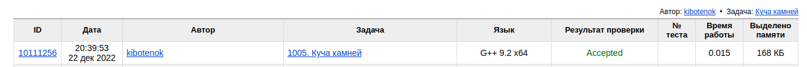

# Задача 1005. Куча камней
Выполнил Антропов Н.А., группа R34351
---
## Условия задачи

Условия задачи представлены на рисунке 1

||
|<b>Рисунок 1. Условия задачи</b>|

## Описание входных/выходных данных

Описание входных/выходных данных представлены на рисунке 2

||
|<b>Рисунок 2. Входные/выходные данные</b>|

## Описание программы
---
### Используемые средства

* Язык программирования: C++
* Версия компилятора: G++ 9.2 x64
* Платформа: Linux

### Структуры данных

Для хранения веса камней используется статический массив с элементами типа unsigned int 
Выбор обуславливается следующими причинами:
* Кол-во элементов в структуре данных в процессе программы не изменяется
* Основная операция с массивом, используемая в программе - получение значения по индексу
* Максимально возможное кол-во данных небольшое (20 элементов), поэтому выбран статический вараинт массива

### Алгоритм

Выбран алгоритм рекурсивного перебора. 
Разница между двумя кучями камней тем меньше, чем ближе их веса к половине от общего веса всех камней. Поэтому достаточно перебирать только одну кучу камней. Остановка перебора - превышение кучей половины обшего веса всех камней или если камни закончились. Перебор начинается с последнего элемента в массиве

Параметры рекурсии:
- Ссылка на массив с данными
- Индекс текущего элемента в массиве
- Общий вес камней
- Вес первой кучи камней

Тривиальный случай:
- Перебрали все камни (индекс равен 0)
- Вес первой кучи стал равен или превысил половину общего веса камней

Рекурсивный вызов (косвенный):
- Минимальное значения от двух вызовов - с добавлением текущего камня в первую кучу и без него

## Результат проверки

Результат проверки в системе Timus online Judge представлен на риснуке 3

||
|<b>Рисунок 3. Результат проверки</b>|
