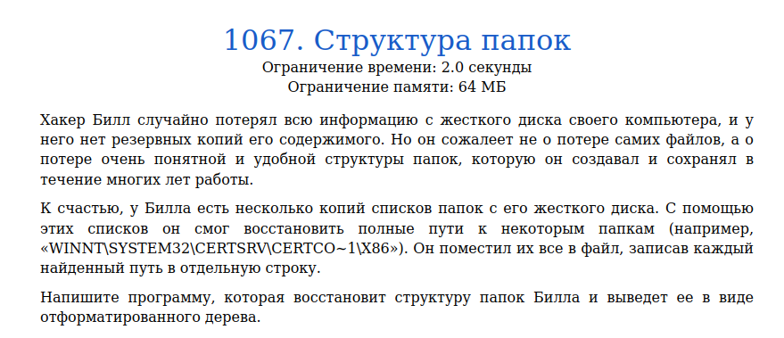
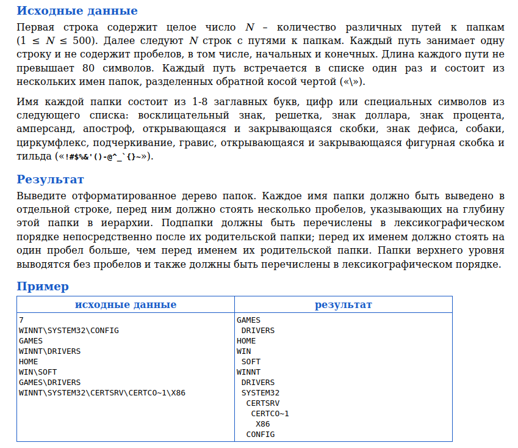
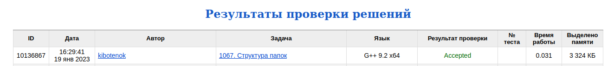

# Задача 1067. Структура папок
Выполнил Антропов Н.А., группа R34351
---
## Условия задачи

Условия задачи представлены на рисунке 1

|  |
|:--:|
| <b>Рисунок 1. Условия задачи</b> |

## Описание входных/выходных данных

Описание входных/выходных данных представлены на рисунке 2

|  |
|:--:|
| <b>Рисунок 2. Входные/выходные данные</b> |

## Описание программы
---
### Используемые средства

* Язык программирования: C++
* Версия компилятора: G++ 9.2 x64
* Платформа: Linux

### Структуры данных

Для хранения данных используется дерево. Узел дерева описывается структурой Tree:
* Поле children - потомки узла (используется std::map)

Выбор обусловлен следующими причинами:
* Каждое значение в узле должно быть уникальным
* Потомки должны сохраняться в лексиграфическом порядке

### Алгоритм

Так как все пути начинаются с корневого каталога, то вставка узлов происходит последовательно от корня дерева. При этом, если заданный узел уже существует, то повторной вставки не происходит. 
Для вывода дерева используется рекурсивный обход в глубину

## Результат проверки

Результат проверки в системе Timus online Judge представлен на рисунке 3

|  |
|:--:|
| <b>Рисунок 3. Результат проверки</b> |
