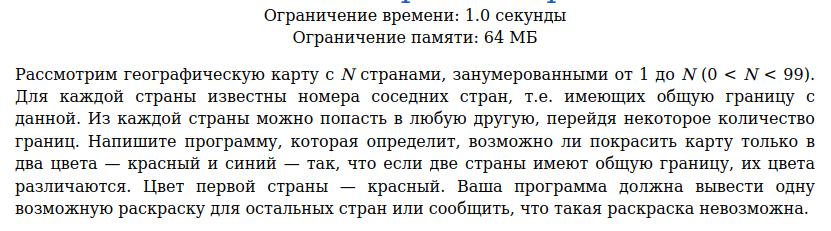
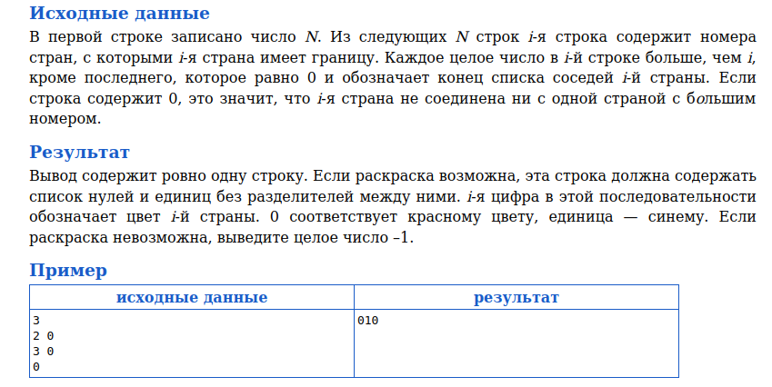
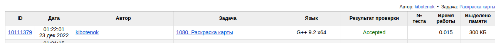

# Задача 1080. Раскраска карты
Выполнил Антропов Н.А., группа R34351
---
## Условия задачи

Условия задачи представлены на рисунке 1

|  |
|:--:|
| <b>Рисунок 1. Условия задачи</b> |

## Описание входных/выходных данных

Описание входных/выходных данных представлены на рисунке 2

|  |
|:--:|
| <b>Рисунок 2. Входные/выходные данные</b> |

## Описание программы
---
### Используемые средства

* Язык программирования: C++
* Версия компилятора: G++ 9.2 x64
* Платформа: Linux

### Структуры данных

Для хранения данных по странам используется структура данных в виде графа. Граф реализован в виде списка смежностей 
Каждая страна представляет собой вершину графа и описывается структурой Node со следующими полями:
* Список с номерами стран, с которыми есть граница (используется std::vector)
* Цвет вершины (используется перечисление Color)
* Состояние вершины (используется перечисление State)

Сам граф представляет собой динамический массив стран (используется std::vector) 
Для реализации алгоритма (обработка вершин в порядке их обнаружения) используется очередь FIFO (std::queue)

### Алгоритм

Выбран алгоритм поиска в ширину для проверки двудольности графа 
Хотя в условиях сказано, что из любой страны можно добраться в любую другую, в тестах имеются варианты, где данное условия нарушается. Поэтому реализована функция, чтобы гарантировать обход графа, даже если он будет несвязный (поиск в ширину на подграфах)

Дополненый алгоритм:
- Перебор всех вершин в графе
- Если вершина еще не обнаружена, раскрашиваем ее в красный цвет и вызваем поиск в ширину с началом в данной вершине
- Если нарушается условие двудольности графа, выходим из алгоритма

Условие нарушения двудольности:
- Вершина, связанная с текущей вершиной, уже обнаружена
- Цвет данных вершин совпадает

## Результат проверки

Результат проверки в системе Timus online Judge представлен на рисунке 3

|  |
|:--:|
| <b>Рисунок 3. Результат проверки</b> |
