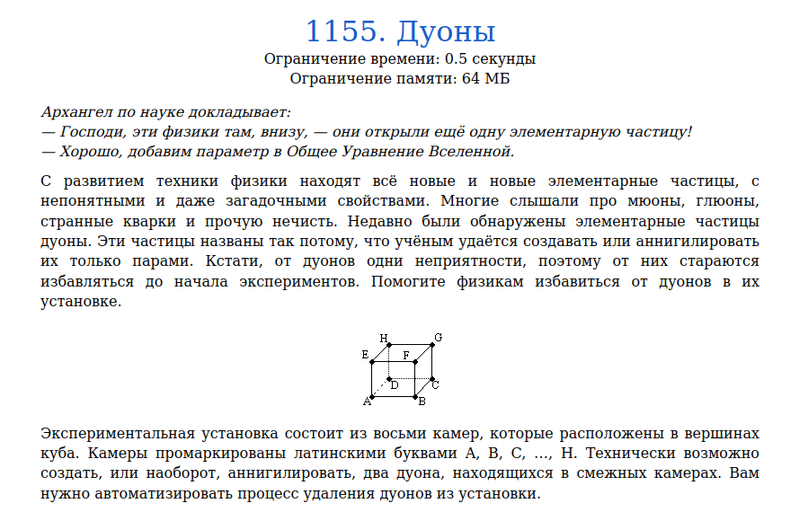
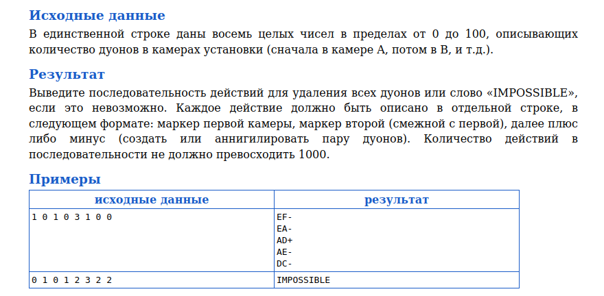
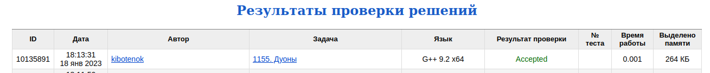

# Задача 1155. Дуоны
Выполнил Антропов Н.А., группа R34351
---
## Условия задачи

Условия задачи представлены на рисунке 1

|  |
|:--:|
| <b>Рисунок 1. Условия задачи</b> |

## Описание входных/выходных данных

Описание входных/выходных данных представлены на рисунке 2

|  |
|:--:|
| <b>Рисунок 2. Входные/выходные данные</b> |

## Описание программы
---
### Используемые средства

* Язык программирования: C++
* Версия компилятора: G++ 9.2 x64
* Платформа: Linux

### Структуры данных

Для хранения вершин куба используется статический массив с элементами типа Node 
Выбор обуславливается следующими причинами:
* Кол-во элементов в структуре данных в процессе программы не изменяется
* Основная операция с массивом, используемая в программе - получение значения по индексу

Для описания вершины куба используется структура Node с двумя полями:
* name - Обозначение вершины типа char
* duons - Количество дуонов типа uint16_t

### Алгоритм

Проверка на неразрешимость:
* Разделим вершины куба на две группы по следующему условию - вершины одной группы должны быть несмежными между собой, но смежными с вершинами из другой группы
* Получаем две группы - вершины A/C/F/H и вершины B/D/E/G
* Так как дуоны можно создавать и удалять только парами из двух смежных вершин, то количество дуонов в первой группе должно совпадать с количеством дуонов во второй группе. Иначе в кубе всегда будет оставаться некоторое количество дуонов, равное разнице данных частиц между двумя группами вершин (вершины внутри группы являются несмежными)
* Следовательно, если количество дуонов в двух заданных группах вершин не совпадает, то задача неразрешима

Алгоритм:
* Начинаем с любой вершины (пусть будет A)
* Удаляем дуоны из вершины A и смежных с ней, пока количество дуонов в A не станет равно 0 или не обойдем все смежные вершины
* Если после обхода всех вершин в A еще оставлись дуоны, то добавляем равное количество дуонов в две смежные вершины таким образом, чтобы одна из этих вершин была смежной для вершины A
* Удаляем дуоны из вершины A и заданной смежной вершины
* Аналогично производим действия с вершинами B, D, E (смежные с A), исключая вершину A (уже обработана)
* После обработки заданных вершин из свойства групп вершин следует, что количество дуонов в вершине G совпадает с суммой дуонов в вершинах C/F/H. Кроме того, C/F/H смежны с G. Тогда удаляем парные дуоны из вершины G и смежных с ней

## Результат проверки

Результат проверки в системе Timus online Judge представлен на рисунке 3

|  |
|:--:|
| <b>Рисунок 3. Результат проверки</b> |
