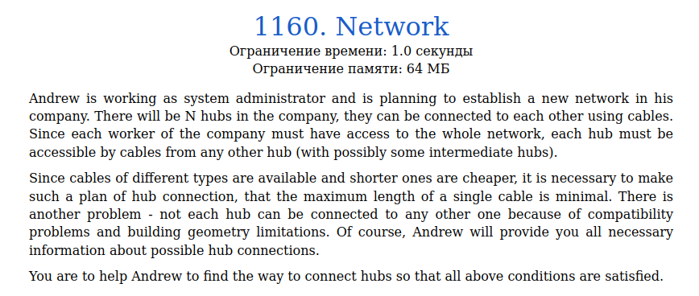

# Задача 1160. Network
Выполнил Антропов Н.А., группа R34351
---
## Условия задачи

Условия задачи представлены на рисунке 1

|  |
|:--:|
| <b>Рисунок 1. Условия задачи</b> |

## Описание входных/выходных данных

Описание входных/выходных данных представлены на рисунке 2

|  |
|:--:|
| <b>Рисунок 2. Входные/выходные данные</b> |

## Описание программы
---
### Используемые средства

* Язык программирования: C++
* Версия компилятора: G++ 9.2 x64
* Платформа: Linux

### Структуры данных

Так как сеть можно представить в виде графа (хабы - вершины, кабели - ребра, длина кабеля - вес ребра), то задача сводится к построению минимального остовного дерева. 
Используем алгоритм Крускала для построения минимального остовного дерева.
Тогда используются следующие структуры данных: 
Для описания ребра графа:
* Поля vertex1, vertex2 - номера вершин, связанных ребром
* Поле weight - вес ребра

Для описания графа:
* Поле edge_n - Количество ребер в графе
* Поле vertex_n - Количество вершин в графе
* Поле edges - Очередь с приоритетом, которая содержит ребра графа (ребра с меньшим весом имеют больший приоритет)

Для построения остовного дерева:
* Поле parent - Массив родителей i-ой вершины
* Поле subtree_n - Массив с кол-вом элементов в поддереве i-ой вершине
* Поле union_n - Общее кол-во элементов (равно кол-ву вершин графа)

На последней структуре осуществляется поиск корней остовных деревьев и их объединение в общее дерево

### Алгоритм

Используется алгоритм Крускала для построения минимального остовного дерева. 
Для этого все ребра графа помещаются в очередь с приоритетом по весу. Кроме того, множество вершин разбивается на подмножества (с 1 вершиной в каждом). Тогда в самом начале, каждая вершина не имеет родителя и имеет по 1 элементу в поддереве. 
Пока очередь не пуста, вытаскиваем верхний элемент и проверяем на наличие цикла (если обе вершины ребра уже принадлежат одному дереву, то при добавлении данного ребра образуется цикл). Если цикла нет, то объединяем два дерева в одно (дерево с меньшим кол-вом узлов делаем поддеревом дерева с большим кол-вом узлов)

## Результат проверки

Результат проверки в системе Timus online Judge представлен на рисунке 3

|  |
|:--:|
| <b>Рисунок 3. Результат проверки</b> |
