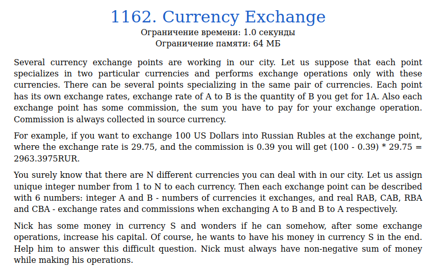
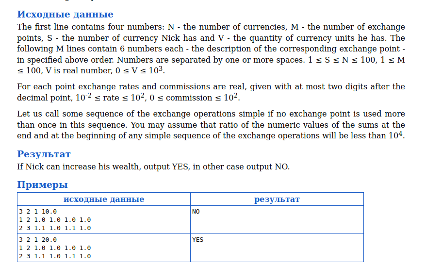
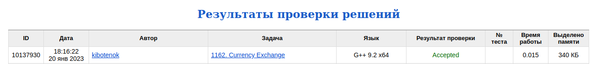

# Задача 1162. Currency Exchange
Выполнил Антропов Н.А., группа R34351
---
## Условия задачи

Условия задачи представлены на рисунке 1

|  |
|:--:|
| <b>Рисунок 1. Условия задачи</b> |

## Описание входных/выходных данных

Описание входных/выходных данных представлены на рисунке 2

|  |
|:--:|
| <b>Рисунок 2. Входные/выходные данные</b> |

## Описание программы
---
### Используемые средства

* Язык программирования: C++
* Версия компилятора: G++ 9.2 x64
* Платформа: Linux

### Структуры данных

Обмен валют можно представить в виде графа (валюта - вершины, обмен валют - ребро). Так как обмен валютами происходит в одну сторону, то граф направленный. Вес каждого ребра от вершины A к B представляет собой функцию (A - CAB)*RAB. 
Используем алгоритм Форда-Беллмана (модификация для поиска наиболее длинного пути), так как граф может содержать отрицательныет веса ребер. 
Так как основное взаимодействие в данном алгоритме происходит с ребрами, то используется следующая структура для графа:
* Поле edges - массив ребер
* Поле F - массив функционалов (расстояний) каждой валюты

Для описания ребра графа используется структура:
* Поля А и B - исходная и конечная валюты (вершины графа)
* Поля rate и com - Курс обмена и коммисия (для расчета функционала)

### Алгоритм

Используется алгоритм Форда-Беллмана (модификация для поиска наиболее длинного пути). 
На каждом шаге итерации выбираем маскимальное значение функционала F для вершины B заданного ребра. Если после всех проходов максимум функционала любой вершины измениться, то значит что мы получаем прибыль при обмене валют

## Результат проверки

Результат проверки в системе Timus online Judge представлен на рисунке 3

|  |
|:--:|
| <b>Рисунок 3. Результат проверки</b> |
