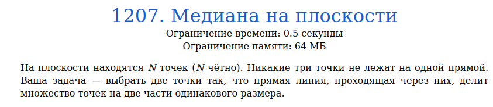
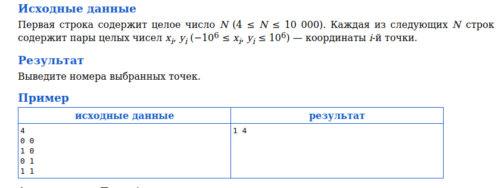
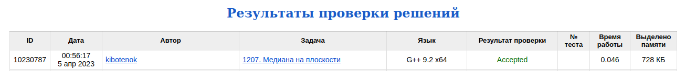

# Задача 1207. Медиана на плоскости
Выполнил Антропов Н.А., группа R34351
---
## Условия задачи

Условия задачи представлены на рисунке 1

|  |
|:--:|
| <b>Рисунок 1. Условия задачи</b> |

## Описание входных/выходных данных

Описание входных/выходных данных представлены на рисунке 2

|  |
|:--:|
| <b>Рисунок 2. Входные/выходные данные</b> |

## Описание программы
---
### Используемые средства

* Язык программирования: C++
* Версия компилятора: G++ 9.2 x64
* Платформа: Linux

### Структуры данных

Каждая точка описывается структурой, имеющей следующие поля:
* Поле id
* Два поля координат по осям X и Y
* Поле угла прямой между заданной точкой и крайней

В качестве структуры данных используется массив точек, так как:
* Кол-во данных не изменяется в процессе работы программы
* В алгоритме используется сортировка
* Основная операция - доступ к элементу по индексу

### Алгоритм

Так как на одной прямой не лежит больше двух точек и их четное количество, то можно сделать следующие утверждения:
* Для любой точки существует такая точка, что прямая через эти две точки является медианой
* Точка, удовлетворяющая условию выше, может быть только одна

Найдем крайную слева по оси X точку для того, чтобы остальные точки оказались с одной стороны от нее. Примем данную точку за начало координат и найдем углы наклона прямых до остальных точек из заданной. Далее отсортируем все точки (кроме нулевой) по возрастанию угла. Так как отсортированный массив будет иметь нечетное кол-во элементов (убрали нулевую точку), то в центре массива всегда будет такой элемент, что кол-во элементов до него будет равно кол-ву элементов после него. Это и будет искомой второй точкой 

В качестве алгоритма сортировки выбран алгоритм быстрой сортировки

## Результат проверки

Результат проверки в системе Timus online Judge представлен на рисунке 3

|  |
|:--:|
| <b>Рисунок 3. Результат проверки</b> |
