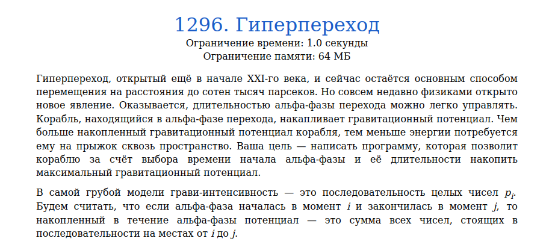
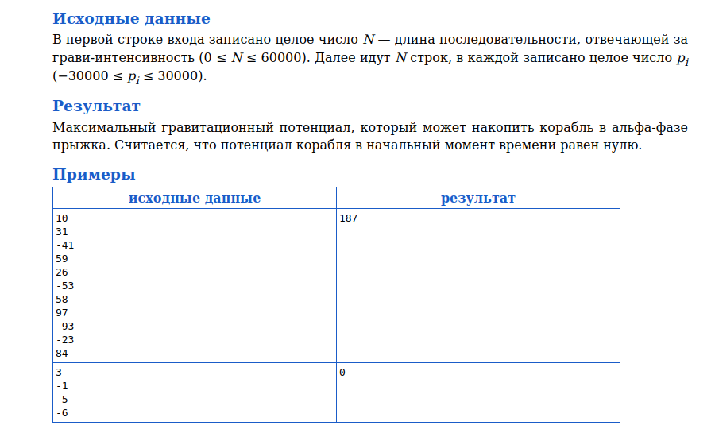
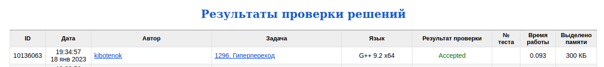

# Задача 1296. Гиперпереход
Выполнил Антропов Н.А., группа R34351
---
## Условия задачи

Условия задачи представлены на рисунке 1

|  |
|:--:|
| <b>Рисунок 1. Условия задачи</b> |

## Описание входных/выходных данных

Описание входных/выходных данных представлены на рисунке 2

|  |
|:--:|
| <b>Рисунок 2. Входные/выходные данные</b> |

## Описание программы
---
### Используемые средства

* Язык программирования: C++
* Версия компилятора: G++ 9.2 x64
* Платформа: Linux

### Структуры данных

Структуры данных не используются

### Алгоритм

Так как по условию задачи гравитационный потенциал накапливается путем прибавления p на i-ом шаге, то для каждой следующей итерации значение с предыдущей итерации является начальным. Тогда, если предыдущее значение отрицательное, то новое значение получится меньше, чем при условии, что мы начали новый прыжок на прошлой итерации (потенциал корабля равен 0). Следовательно, для получения максимального значения на i-ом шаге текущий потенциал должен быть больше или равен 0, иначе сбрасываем до 0

Алгоритм:
* Задаем максимальный гравитационный потенциал равным 0
* Итеративно считываем новое значение p и прибавляем к текущему гравитационному потенциалу
* На i-ом шаге проверяем текущий гравитационный потенциал. Если он отрицательный, сбрасываем его до 0
* На i-ом шаге проверяем, первысил ли текущий гравитационный потенциал максимальный. Если да, то изменяем максимальное значение на новое

## Результат проверки

Результат проверки в системе Timus online Judge представлен на рисунке 3

|  |
|:--:|
| <b>Рисунок 3. Результат проверки</b> |
