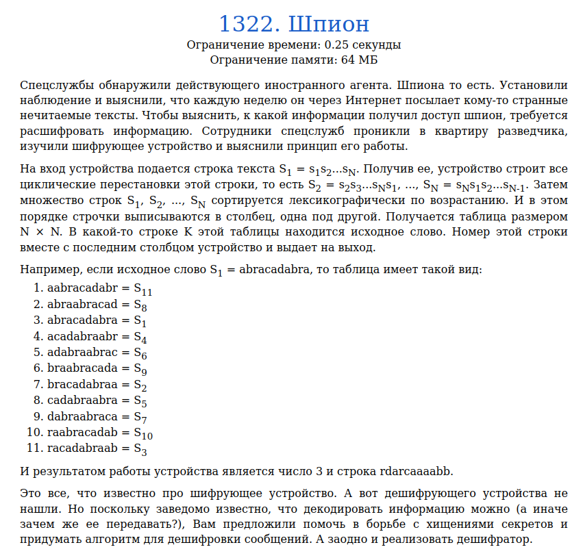
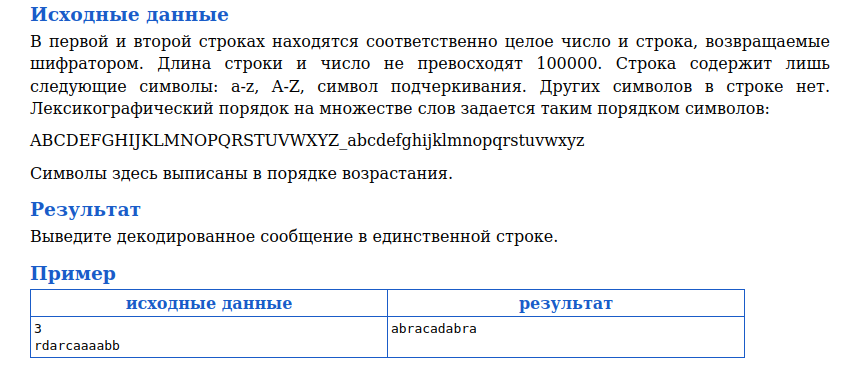
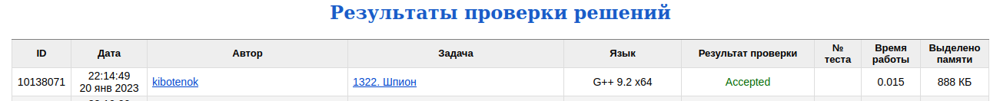

# Задача 1322. Шпион
Выполнил Антропов Н.А., группа R34351
---
## Условия задачи

Условия задачи представлены на рисунке 1

|  |
|:--:|
| <b>Рисунок 1. Условия задачи</b> |

## Описание входных/выходных данных

Описание входных/выходных данных представлены на рисунке 2

|  |
|:--:|
| <b>Рисунок 2. Входные/выходные данные</b> |

## Описание программы
---
### Используемые средства

* Язык программирования: C++
* Версия компилятора: G++ 9.2 x64
* Платформа: Linux

### Структуры данных

Используется алгоритм обратного преобразования Берроуза-Вилера. 
Для хранения вектора T и таблицы D используется динамический массив (std::vector). Выбор обусловлен следующими причинами:
* Размер вектора T заранее не известен
* Размеры вектора T и таблицы D не изменяются в процессе работы программы
* Основная операция - доступ к элементу вектора/таблицы по индексу

### Алгоритм

Используется алгоритм обратного преобразования Берроуза-Вилера. 
Для обратного преобразования требуется вычислить вектор смещений T. Для этого высчитывается частота каждого символа в строке (в таблицу D). При этом, значение помещается в следующую от индекса символа ячейку. Это необходимо, чтобы при расчете кол-ва символов до заданного в алфавитном порядке у первого символа осталось значение 0. 
Далее расчитывается T(i) = D(str(i)) + P(i), где P(i) - кол-во i-го символа, найденых в строке до данной позиции. В программе данная конструкция заменена T(i) = D(str(i))++. 
Однако, так как требуется вывести символы в прямом порядке, а преобразование идет с конца строки, то осуществляется инверсия T(D(str(i))++) = i

## Результат проверки

Результат проверки в системе Timus online Judge представлен на рисунке 3

|  |
|:--:|
| <b>Рисунок 3. Результат проверки</b> |
