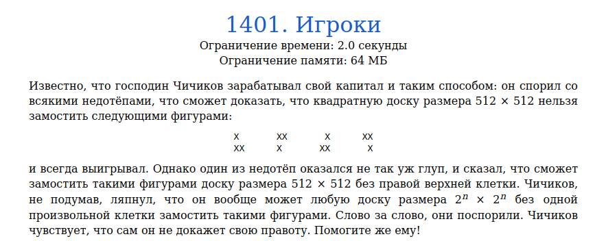
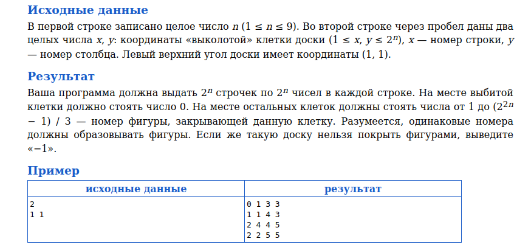
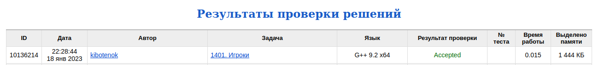

# Задача 1401. Игроки
Выполнил Антропов Н.А., группа R34351
---
## Условия задачи

Условия задачи представлены на рисунке 1

|  |
|:--:|
| <b>Рисунок 1. Условия задачи</b> |

## Описание входных/выходных данных

Описание входных/выходных данных представлены на рисунке 2

|  |
|:--:|
| <b>Рисунок 2. Входные/выходные данные</b> |

## Описание программы
---
### Используемые средства

* Язык программирования: C++
* Версия компилятора: G++ 9.2 x64
* Платформа: Linux

### Структуры данных

Доска в программе представлена двумерным массивом (используется std::vector)
Выбор обуславливается следующими причинами:
* Кол-во элементов в структуре данных в процессе компиляции неизвестно
* Кол-во элементов в структуре данных в процессе программы не изменяется
* Основная операция с массивом, используемая в программе - получение значения по индексу

### Алгоритм

По условию размер доски (квадрат) всегда кратен степеням двойки. Кроме того, имеем тривиальный случай решения задачи, когда размер квадрата - 2. Предположим, что мы можем заполнить заданными фигурами квадрат размера 2^n с выколотой клеткой. Тогда попробуем решить задачу для размера 2^(n+1). Для этого воспользуемся методом "разделяй и властвуй" - разобъем квадрат на 4 квадрата размером 2^n. Для квадрата с окном задачу решить можно. Для оставшихся трех квадратов требуется данное окно сделать - для этого заполняем фигурой оставшиеся 3 клетки из центра квадрата размера 2^(n+1)
Выбран рекурсивный алгоритм 

Параметры рекурсии:
- Ссылка на структуру с данными
- Ссылка на порядковый номер фигуры
- Размер квадрата
- Координаты левого верхнего края квадрата
- Координаты окна (выколотая клетка)

Тривиальный случай:
- Размер квадрата равен 2

Рекурсивный вызов:
- Заполнение центра квадрата фигурой
- Дробление квадрата на 4 части с вызовом функции для каждого из них

## Результат проверки

Результат проверки в системе Timus online Judge представлен на рисунке 3

|  |
|:--:|
| <b>Рисунок 3. Результат проверки</b> |
