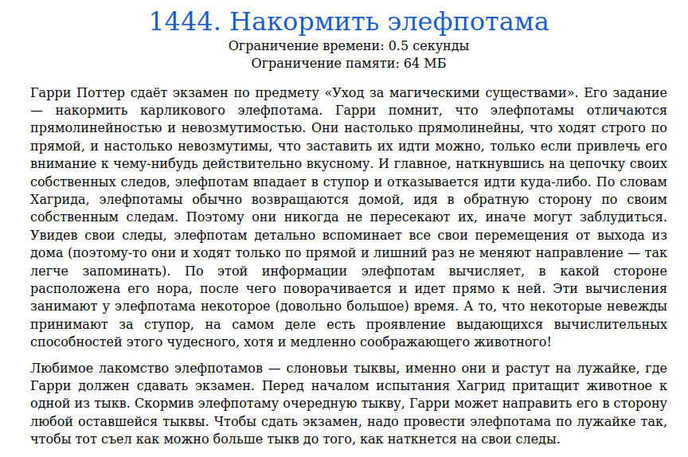
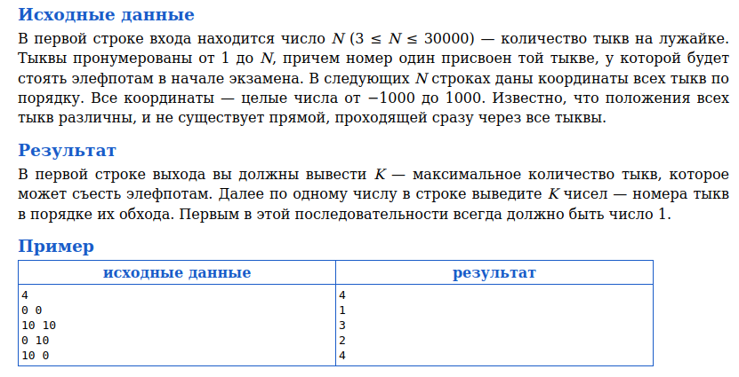
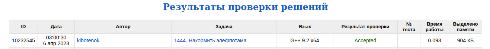

# Задача 1444. Накормить элефпотама
Выполнил Антропов Н.А., группа R34351
---
## Условия задачи

Условия задачи представлены на рисунке 1

|  |
|:--:|
| <b>Рисунок 1. Условия задачи</b> |

## Описание входных/выходных данных

Описание входных/выходных данных представлены на рисунке 2

|  |
|:--:|
| <b>Рисунок 2. Входные/выходные данные</b> |

## Описание программы
---
### Используемые средства

* Язык программирования: C++
* Версия компилятора: G++ 9.2 x64
* Платформа: Linux

### Структуры данных

Тыква описывается следующей структурой:
* Поле с ID тыквы
* Поле с расстоянием до тыквы из стартовой точки
* Поле с углом между тыквой и осью X

В качестве структуры данных используется массив тыкв, так как:
* Кол-во данных не изменяется в процессе работы программы
* В алгоритме используется сортировка
* Основная операция - доступ к элементу по индексу

### Алгоритм

Из условий можно сделать следующие утверждения:
* Для перехода от точки к точке следует выбирать ближайшую по углу, начиная с точки с минимальным углом
* Могут сущестовать точки, лежащие на одной прямой, однако расстояние до них от стартовой точки различно

Первое утверждение исходит из условий, что положение точек различно и прямые между точками при обходе не должны пересекаться. Так как угол каждой следующей точки увеличивается, то это гарантирует, что в данном секторе мы еще не были 
Второе утверждение исходит из условий, что положение точек различно и не все точки лежат на одной прямой. Соответственно, при равенстве углов двух точек нужно выбрать ту, у которой расстояние до стартовой точки меньше, иначе может возникнуть пересечение прямых. Например, две точки лежат на одной прямой с минимальным углом. Тогда после выборе дальней точки из стартовой при переходе к ближней точке на данной прямой всегда будет пересение независимо от кол-ва точек, пройденных между данными двумя точками 
При этом стоит отметить, что разница соседних углов может превышать 180 градусов (такая разница может быть только одна). В таком случае необходимо иключить данный переход из пути, так как иначе может возникнуть пересечение. Для этого нужно найти переломный угол, и сначала пройти путь по углам после него, а затем по углам до него 
Итоговый алгоритм:
* Расчет углов через тангенс относительно стартовой точки и квадрата расстояния до точек
* Сортировка точек в порядке возрастания по углам, при равенстве углов по возрастанию расстояния
* Проверка на угол больше 180 градусов. В качестве стартового значения используется разница углов между наименьшим и наибольшим углами (против часовой стрелки, так как по часовой стрелке между данными точками всегда лежат другие точки). Далее поиск переломной точки осуществляется путем сравнения разницы углов между двумя соседними точками с максимальной разницей
* Вывод точек в заданном порядке

При этом максимальное кол-во точек для обхода всегда будет равно общему кол-ву точек. В качестве алгоритма сортировки выбрана быстрая сортировка

## Результат проверки

Результат проверки в системе Timus online Judge представлен на рисунке 3

|  |
|:--:|
| <b>Рисунок 3. Результат проверки</b> |
