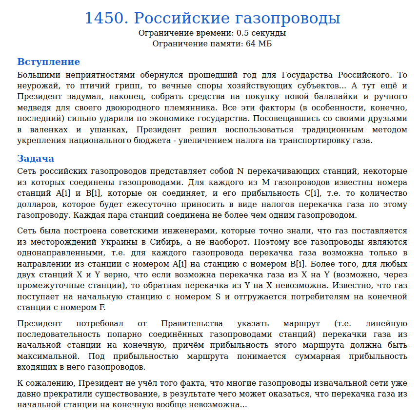
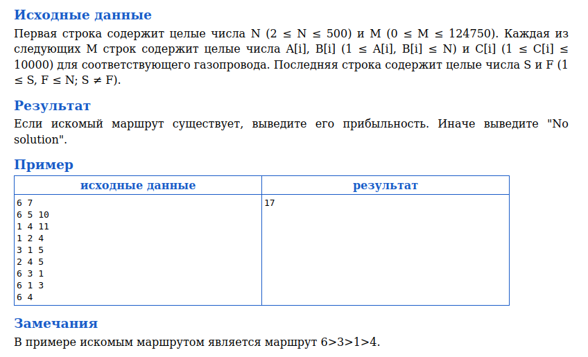
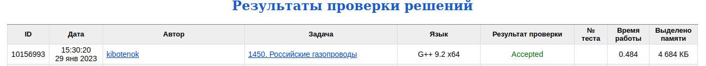

# Задача 1450. Российские газопроводы
Выполнил Антропов Н.А., группа R34351
---
## Условия задачи

Условия задачи представлены на рисунке 1

|  |
|:--:|
| <b>Рисунок 1. Условия задачи</b> |

## Описание входных/выходных данных

Описание входных/выходных данных представлены на рисунке 2

|  |
|:--:|
| <b>Рисунок 2. Входные/выходные данные</b> |

## Описание программы
---
### Используемые средства

* Язык программирования: C++
* Версия компилятора: G++ 9.2 x64
* Платформа: Linux

### Структуры данных

Газопровод можно представить в виде графа (станции - вершины, газопроводы - ребро). Так как перекачка газа происходит только от X к Y, то граф направленный. Вес каждого ребра от вершины A к B представляет собой значение C. 
Так как основное взаимодействие в данном алгоритме происходит с ребрами, то используется следующая структура для графа:
* Поле edges - массив газопроводов (ребер)
* Поле F - массив функционалов (расстояний) каждой станции

Для описания ребра графа используется структура:
* Поля А и B - исходная и конечная станции (вершины графа)
* Поля C - налог на перекачку газа (для расчета функционала)

### Алгоритм

Используется алгоритм Форда-Беллмана (модификация для поиска наиболее длинного пути). 
Изначально фнкционал всех вершин равен -1, кроме начальной вершины S (принимает значение 0). 
На каждом шаге итерации выбираем маскимальное значение функционала F для вершины B заданного ребра при следующих условиях:
* Если расстояние до вершины A не равно -1. В ином случае вершина A еще не посещена, следовательно функционал из A в B подсчитать нельзя

Так как по условию граф ациклический, то проверку на отрицательные циклы не проводим. Если в конечной вершине F функционал равен -1, значит из вершины S данная вершина недостижима. Следовательно, нет решения поставленной задачи

## Результат проверки

Результат проверки в системе Timus online Judge представлен на рисунке 3

|  |
|:--:|
| <b>Рисунок 3. Результат проверки</b> |
