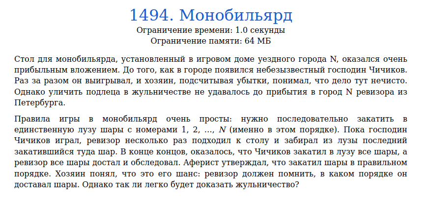
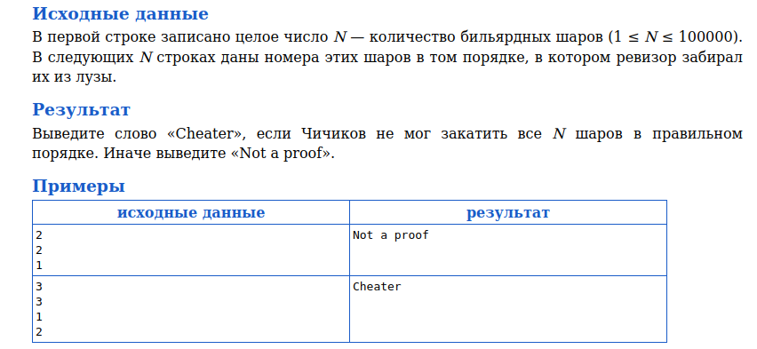
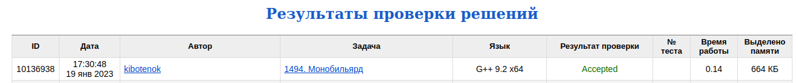

# Задача 1494. Монобильярд
Выполнил Антропов Н.А., группа R34351
---
## Условия задачи

Условия задачи представлены на рисунке 1

|  |
|:--:|
| <b>Рисунок 1. Условия задачи</b> |

## Описание входных/выходных данных

Описание входных/выходных данных представлены на рисунке 2

|  |
|:--:|
| <b>Рисунок 2. Входные/выходные данные</b> |

## Описание программы
---
### Используемые средства

* Язык программирования: C++
* Версия компилятора: G++ 9.2 x64
* Платформа: Linux

### Структуры данных

Для хранения правильной последовательности шаров используется стек (по аналогии с лункой для шаров). 
Стек выбран по следующим причинам:
* Сохранение порядка шаров при добавлении
* Аналогия с лункой из задачи (порядок FILO)
* Основная операция - сравнение с последним элементом последовательности

### Алгоритм

Необходимо проверить, соотвествует ли последовательность шаров правильной (1 < 2 < ... < N). 
Условие невыполнения данной задачи:
* Текущий шар не соотвествует последнему (верхнему) шару из правильной последовательности

Так как значение шара может быть больше, чем текущее максимальное, то разницу компенсируем путем добавления данной последовательности в стек

## Результат проверки

Результат проверки в системе Timus online Judge представлен на рисунке 3

|  |
|:--:|
| <b>Рисунок 3. Результат проверки</b> |
