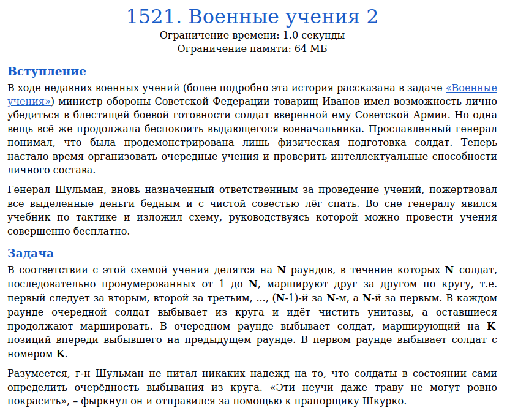
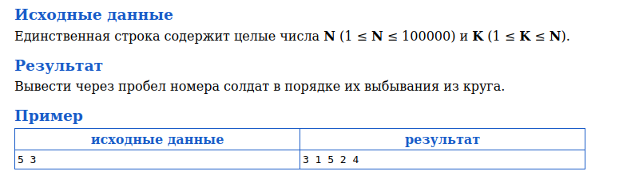
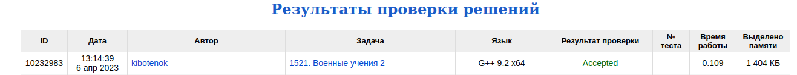

# Задача 1521. Военные учения 2
Выполнил Антропов Н.А., группа R34351
---
## Условия задачи

Условия задачи представлены на рисунке 1

|  |
|:--:|
| <b>Рисунок 1. Условия задачи</b> |

## Описание входных/выходных данных

Описание входных/выходных данных представлены на рисунке 2

|  |
|:--:|
| <b>Рисунок 2. Входные/выходные данные</b> |

## Описание программы
---
### Используемые средства

* Язык программирования: C++
* Версия компилятора: G++ 9.2 x64
* Платформа: Linux

### Структуры данных

В качестве структуры данных используется дерево отрезков, представленное контейнером vector с размером $2(N + 1)$ 
Структура дерева отрезков выбрана, так как листья расположены в порядке возрастания номера солдата и в кадлом узле мы знаем, сколько потомком у нас осталось. Это позволяет быстрее переходить к новому листу, чем при линейном перебора k листов от удаленного (например, при реализации задачи на списке) 
Также задано перечисление с направлениями обхода дерева:
* От родителя к потомку
* От левого потомка к родителю
* От правого потомка к родителю

### Алгоритм

Для построения дерева отрезков используется алгоритм построения снизу (от листье к корню) 
Алгоритм обхода дерева в нужном порядке:
1. Пока остались листья
    1. Если еще не было удаления элементов, то удаляем лист на k позиции
    1. Расчет индекса удаленного листа
    1. Уменьшение на 1 значений вершин при подъеме от удаленного листа до корня
    1. Пока остались шаги до следующего листа
        1. Если переходим от родителя к потомку
            1. Если есть левый потомок и кол-во его листов меньше, чем шагов, то сокращаем кол-во шагов на кол-во листов и переходим к правому потомку
            1. Иначе если находимся в листе, сокращаем шаг на единицу
            1. Иначе переходим к левому потомку
        1. Иначе если переходим от правого потомка к родителю
            1. Проверяем правильность перехода, иначе меняем на левый
            1. Переходим к родителю
        1. Иначе при переходе от левого потомка к родителю
            1. Если есть правый потомок и кол-во шагов меньше, чем кол-во листов в нем, то уменьшаем шаг на кол-во листов, проверяем правильность перехода и поднимаемся к родителю
            1. Иначе переходим к правому потомку
        1. Если элемент оказался правым крайним листом, то уменьшаем шаг на его значение и переходим к левому крайнему листу
    1. Расчет индекса полученного листа и вывод

## Результат проверки

Результат проверки в системе Timus online Judge представлен на рисунке 3

|  |
|:--:|
| <b>Рисунок 3. Результат проверки</b> |
