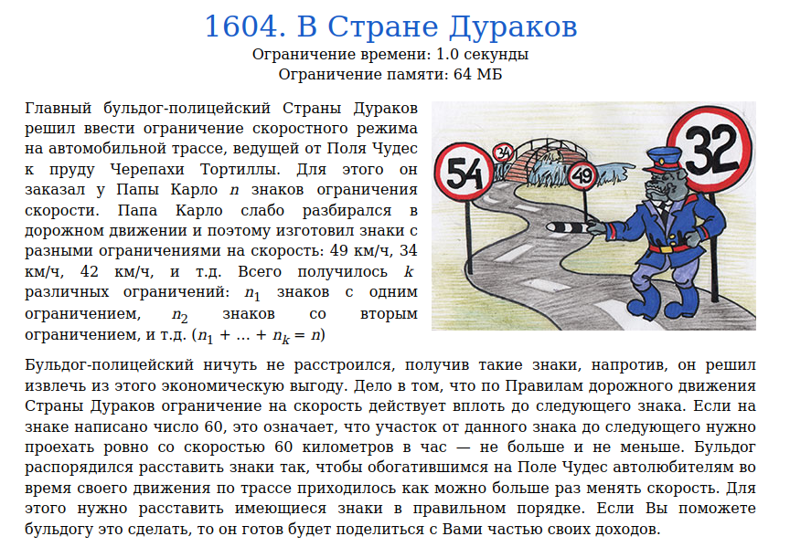
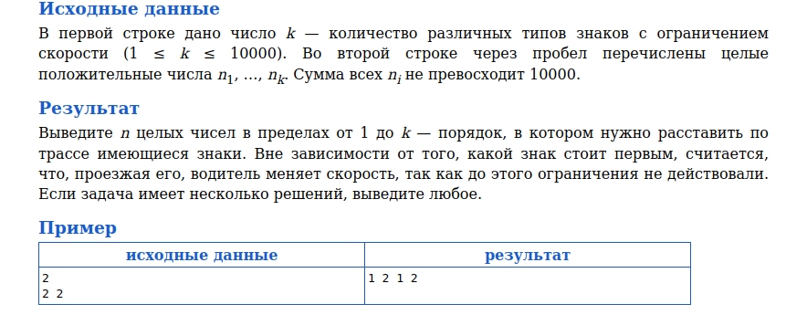
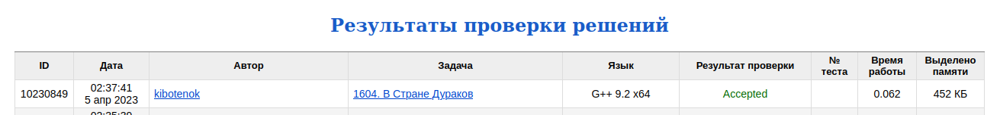

# Задача 1604. В Стране Дураков
Выполнил Антропов Н.А., группа R34351
---
## Условия задачи

Условия задачи представлены на рисунке 1

|  |
|:--:|
| <b>Рисунок 1. Условия задачи</b> |

## Описание входных/выходных данных

Описание входных/выходных данных представлены на рисунке 2

|  |
|:--:|
| <b>Рисунок 2. Входные/выходные данные</b> |

## Описание программы
---
### Используемые средства

* Язык программирования: C++
* Версия компилятора: G++ 9.2 x64
* Платформа: Linux

### Структуры данных

Каждый тип знака описывается структурой, имеющей следующие поля:
* Поле id
* Поле с кол-вом знаков

В качестве структуры данных используется массив знаков, так как:
* Кол-во данных не изменяется в процессе работы программы
* Основная операция - доступ к элементу по индексу

### Алгоритм

Рассмотрим возможные варианты:
* Кол-во знаков разного типа одинаково
* Кол-во знаков одного типа превышает половину от общего кол-ва
* Кол-во знаков одного типа не превышает половины от общего кол-ва

В первом случае получается оптимальный вариант - все знаки чередуются равномерно и без повторов 
Во втором случае всегда будет некоторое кол-во повторяющихся знаков одного типа, когда оставшася часть будет представлять собой последовательность из чередующихся знаков типа, кол-во которого больше половины, и остальных знаков 
В третьем варианте возможно разместить все знаки без повторений в зависимости от их кол-ва. Для этого воспользуемся следующей стратегией:
* Выбираем тип с максимальным кол-вом оставшихся знаков
* Вибираем тип с минимальным кол-вом оставшихся знаков
* Чередуем два знака полученных типов
* Повторяем действия, пока не закончатся все знаки

Таким образом максимальное кол-во знаков при смене типа будет уменьшаться, а минимальное кол-во знаков наоборот будет увеличиваться, что сведется к первому случаю через некоторое кол-во итераций. Для охвата второго варианта необходимо предусмотреть условие, когда останется только один тип знаков (то есть минимальное кол-во знаков совпадет с максимальным)

## Результат проверки

Результат проверки в системе Timus online Judge представлен на рисунке 3

|  |
|:--:|
| <b>Рисунок 3. Результат проверки</b> |
