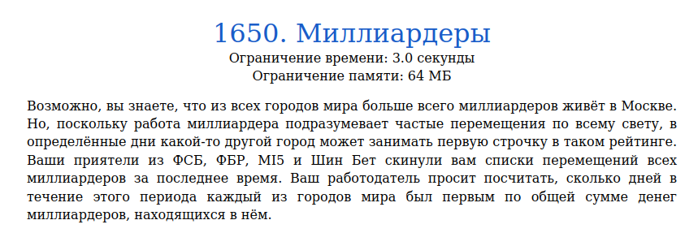
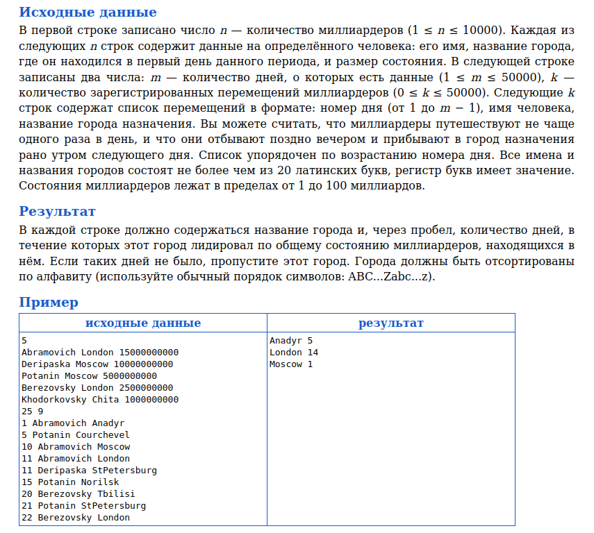
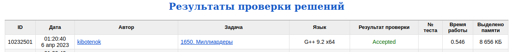

# Задача 1650. Миллиардеры
Выполнил Антропов Н.А., группа R34351
---
## Условия задачи

Условия задачи представлены на рисунке 1

|  |
|:--:|
| <b>Рисунок 1. Условия задачи</b> |

## Описание входных/выходных данных

Описание входных/выходных данных представлены на рисунке 2

|  |
|:--:|
| <b>Рисунок 2. Входные/выходные данные</b> |

## Описание программы
---
### Используемые средства

* Язык программирования: C++
* Версия компилятора: G++ 9.2 x64
* Платформа: Linux

### Структуры данных

Каждый миллиардер описывается следующей структурой:
* Поле с текущим местоположением
* Поле с размером состояния

Информация о миллиардерах представлена контейнером unordered_map:
* Ключ - фамилия миллиардера
* Значение - структура, описанная выше

Информация о городах представлена структурой со следующими полями:
* Контейнер unordered_map с описанием капитализации городов (ключ - название города, значение - капитализация)
* Контейнер map с описанием лидеров по капитализации в порядке убывания (ключ - капитализация, значение - контейнер set с множеством городов, имеющих соответствующую капитализацию)
* Контейнер map с топом городов по кол-ву дней с максимальной капитализацией в лексикографическом порядке (ключ - название города, значение - кол-во дней)

### Алгоритм

Над данными производятся следующие действия:
* Добавление нового миллиардера
* Смена города миллиардером
* Изменение капитализации города
* Обновление топа городов

Первое действие - добавление в структуру с миллиардерами нового значения 
Второе действие - поиск миллиардера в структуре с миллиардерами по фамилии и изменение соотвествующего поля 
Третье действие - поиск города в структуре с капитализацие городов по названию. Если город уже есть в списке, то удаляем его из структуры с лидерами и изменяем капитализацию, иначе добавляем новый город в структуру с капитализацией. После этого обновляем структуру с лидерами (добавляем город в множество с новой капитализацией). Для уменьшения кол-ва операций и памяти проверяем, что капитализация города не равна нулю 
Четвертое действие - если первый элемент структуры с лидерами представлен множеством мощности 1 и кол-во прошедших дней больше 0, то поиск города по названию в структуре с топом городов. Если город уже есть, то увеличиваем кол-во дней, иначе добавляем городо в топ с заданным кол-вом дней 

Общий алгоритм:
* Добавление новых миллиардеров и изменение капитализации городов
* Пока не закончаться перемещения, обновляем топ городов, изменяем капитализацию текущего города, изменяем капитализацию нового города и меняем местоположение миллиардера
* Вывод топа городов в заданном порядке

## Результат проверки

Результат проверки в системе Timus online Judge представлен на рисунке 3

|  |
|:--:|
| <b>Рисунок 3. Результат проверки</b> |
