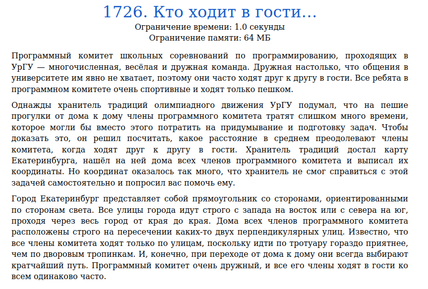
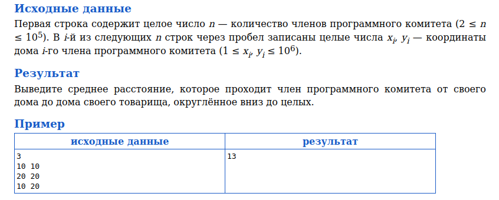
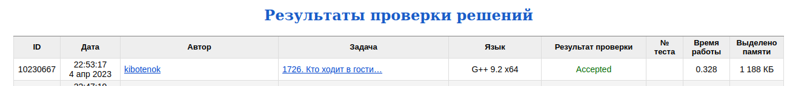

# Задача 1726. Кто ходит в гости...
Выполнил Антропов Н.А., группа R34351
---
## Условия задачи

Условия задачи представлены на рисунке 1

|  |
|:--:|
| <b>Рисунок 1. Условия задачи</b> |

## Описание входных/выходных данных

Описание входных/выходных данных представлены на рисунке 2

|  |
|:--:|
| <b>Рисунок 2. Входные/выходные данные</b> |

## Описание программы
---
### Используемые средства

* Язык программирования: C++
* Версия компилятора: G++ 9.2 x64
* Платформа: Linux

### Структуры данных

В качестве структур данных используются два массива типа uint32_t (один для координат по оси X, другой по оси Y), так как:
* Кол-во данных не изменяется в процессе работы программы
* В алгоритме используется сортировка
* Основная операция - доступ к элементу по индексу

### Алгоритм

Рассмотрим полученные данные как граф. Так как мы можем передвигаться только параллельно одной из осей и маршрут должен быть единственным, то получаем следующие утверждения:
* Вес ребра описывается расстоянием городских кварталов $w = | x_{1} - x_{2} | + | y_{1} - y_{2} |$
* Если расстояние между двумя вершинами равно сумме расстояний между данными вершинами и третьей вершиной, то маршрут проходит через нее (соединены ребрами)
* Если имеется несколько верши, удовлетворяющих предыдущему условию, то маршрут проходит только через одну из них

На основе данных утверждений можно заключить, что кадое ребро соединяет два несвязнных друг с другом подграфа. Тогда количество маршрутов между вершинами подграфов, в которых участвует данное ребро:

$$ k = i(n - i) $$

где $i$ - кол-во вершин в одном подграфе, $n - i$ - кол-во вершин в другом подграфе 
Тогда для нахождения суммарного расстояния всех возможных маршрутов достаточно просуммировать $kw$ расстояний для каждого ребра 
Чтобы не строить граф, достаточно отсортивать полученные координаты по соотвествущим осям в порядке возрастания и рассчитывать расстояния путем вычитания двух соседних координат 

Тогда итоговый алгоритм:
* Сортировка по возрастанию массивов по координатам X и Y
* Сложение расстояний по полученным массивам в один проход
* Расчет среднего пути

В качестве алгоритма сортировки выбран алгоритм быстрой сортировки

## Результат проверки

Результат проверки в системе Timus online Judge представлен на рисунке 3

|  |
|:--:|
| <b>Рисунок 3. Результат проверки</b> |
