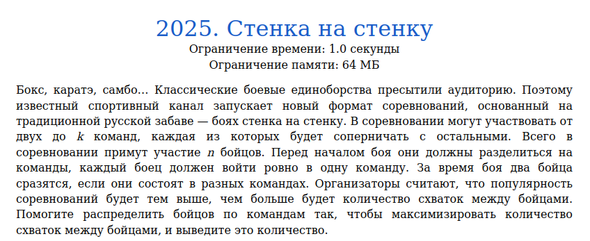
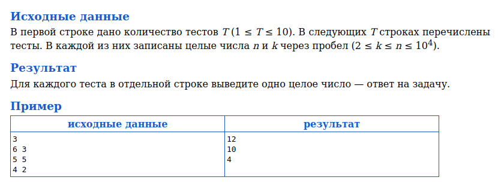
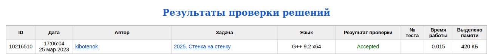

# Задача 2025. Стенка на стенку
Выполнил Антропов Н.А., группа R34351
---
## Условия задачи

Условия задачи представлены на рисунке 1

|  |
|:--:|
| <b>Рисунок 1. Условия задачи</b> |

## Описание входных/выходных данных

Описание входных/выходных данных представлены на рисунке 2

|  |
|:--:|
| <b>Рисунок 2. Входные/выходные данные</b> |

## Описание программы
---
### Используемые средства

* Язык программирования: C++
* Версия компилятора: G++ 9.2 x64
* Платформа: Linux

### Структуры данных

Используется переменная типа uint32_t для хранения целого от деления n на k

### Алгоритм

Кол-во боев будет равно произведению кол-ва участником одной команды на кол-во участников другой команды. Следовательно, нам требуется максимизировать сумму попарных произведений (без повторений) 
Есть два варианта по соотношению кол-ва участников и кол-ва команд:
* Кол-во участников n кратно кол-ву команд k
* Кол-во участников n не кратно кол-ву команд k

Рассмотрим первый вариант для двух команд. Пусть $n_{1}$ - кол-во участников первой команды, $n_{2}$ - кол-во участников второй команды. Тогда верны следующие утверждения:
* $n_{1} >= n_{2} >= 1$
* $n_{1} + n_{2} = n$
* $n_{1}*n_{2} >= 1$

Выразим $n_{2}$ в последнем неравенстве через $n$:

$$ n_{1}*(n - n_{1}) >= 1 $$
$$ n*n_{1} - n_{1}^2 - 1 >= 0 $$

Найдем экстремум данной функции:

$$ n_{1} = (n \over 2) $$

Данный экстремум является максимумом. Следовательно, в первом случае максимальное значение будет при $n_{1} = n_{2}$. То есть при равномерном распределении участников по командам. 

Рассмотрим второй случай для двух команд. Пусть $n_{1}$ - кол-во участников первой команды, $n_{2}$ - кол-во участников второй команды. Тогда верны следующие утверждения:
* $n_{1} > n_{2} >= 1$
* $e = n_{1} - n_{2} >= 1$

Докажем, что при переносе одного участника из одной команды в другую кол-во боев увеличивается или не изменяется:

$$ n_{2}*n_{1} <= (n_{2}+1)*(n_{1}-1) $$
$$ n_{2}*(n_{2} + e) <= (n_{2}+1)*(n_{2} + e -1) $$
$$ e >= 1 $$

Полученный результат совпал с заданными утверждениями. Следовательно, при уменьшении разницы в кол-ве участников между двумя командами кол-во боев увеличивается. Тогда для максимизации кол-ва боев необходимо равномерно распределить кол-во участников $n div k$ по $k$ командам, а оставшихся $n mod k$ участников распределить по $n mod k$ командам по 1, чтобы максимальная разница между любыми двумя командами не превышала 1. 
Для подсчета воспользуемся формулой сочетания из комбинаторики:

$$ r = n div k $$
$$ e = n mod k $$
$$ res = C_{k-e}^2*r^2 + C_{e}^2*(r+1)^2 + (k-m)*r*m*(r+1) $$

## Результат проверки

Результат проверки в системе Timus online Judge представлен на рисунке 3

|  |
|:--:|
| <b>Рисунок 3. Результат проверки</b> |
